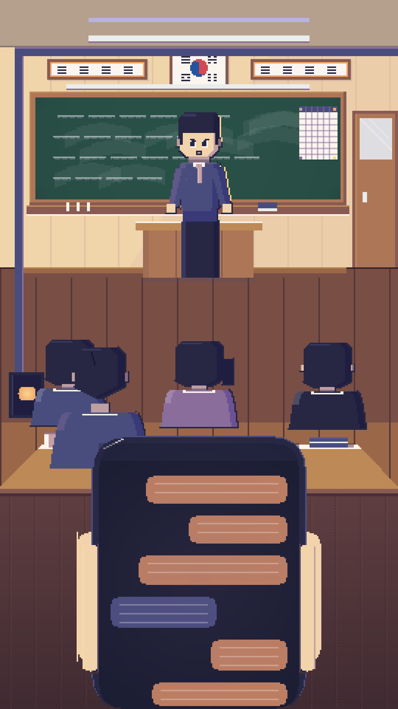
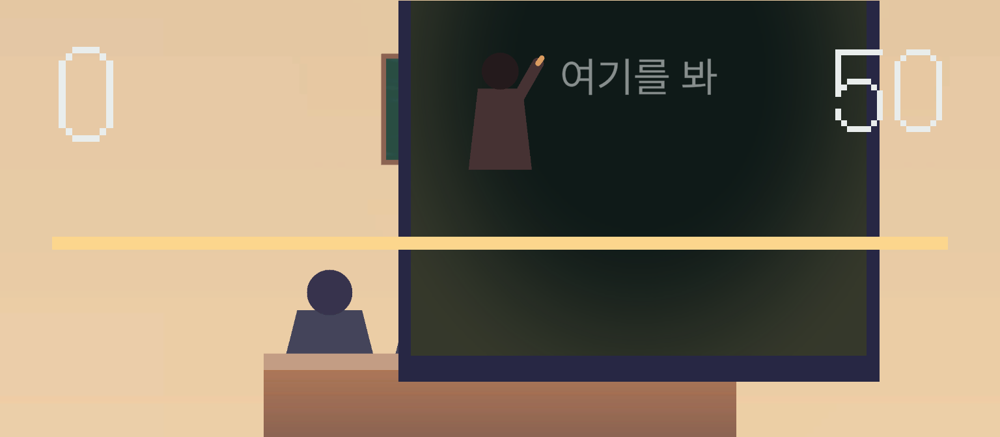
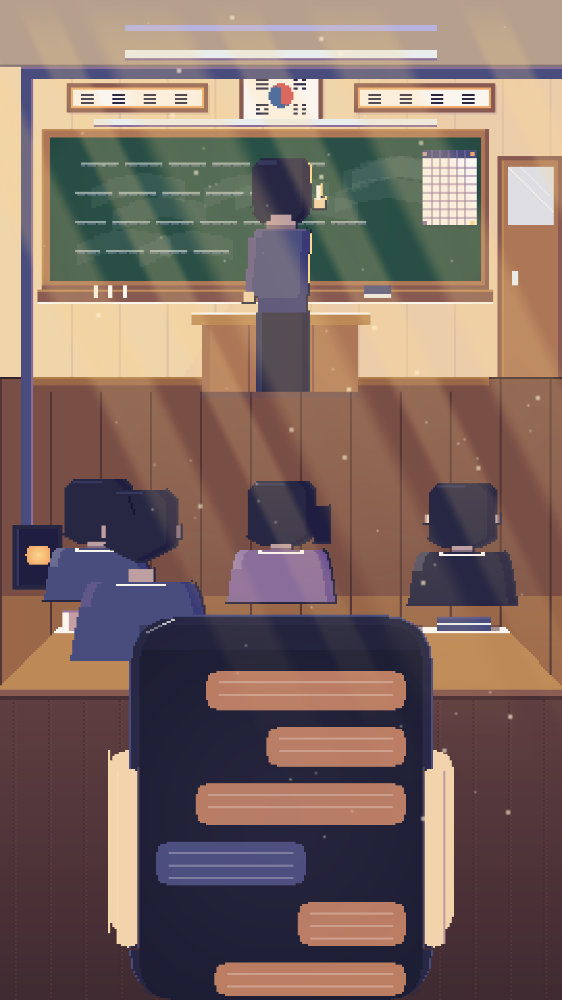

<div align="center">

# 선생님 몰래폰

**눈으로 하는 스릴 게임**

손가락은 쓰지 않습니다. 선생님이 칠판을 볼 때만 폰을 보세요.<br>
돌아봤는데 계속 보고 있으면 — 걸립니다.

<br>


<br>

  

</div>

---

## 이게 뭔가요

수업 시간에 몰래 폰 보던 그 긴장감을 그대로 옮긴 게임입니다.

조작이 없습니다. **전면 카메라가 당신의 시선을 읽습니다.** 폰 화면을 내려다보면 점수가 오르고, 선생님이 돌아볼 때 시선을 못 거두면 걸립니다. 화면을 만질 필요도, 기울일 필요도 없습니다. 진짜로 눈만 씁니다.

한 판은 3교시. **한 번이라도 걸리면 즉시 실패입니다.**

<br>

## 핵심 루프

```
선생님 판서 (안전)  ──▶  텔레그래프 (예고)  ──▶  선생님 응시 (위험)  ──▶  복귀
      ▲                                                   │
      │              폰 보면 점수 ↑                        │  아직 폰 보면 → 적발
      └───────────────────────────────────────────────────┘
```

**유예 시간(grace)** 이 있습니다. 선생님이 돌아본 직후 0.2~0.35초 동안은 봐줍니다. 사람이 반응하는 데 필요한 최소 시간이기 때문입니다.

> 시각 자극 반응 250ms + 시선 이동 100ms + 트래커 지연 100ms ≈ **450ms**
>
> 이보다 짧으면 "어려운 게임"이 아니라 "불가능한 게임"이 됩니다. 그래서 유예는 0.2초 밑으로 내리지 않고, 대신 **인지 속도**를 올려 난이도를 만듭니다.

<br>

## 난이도 설계

| | **1교시** | **2교시** | **3교시** |
|---|---|---|---|
| 길이 | 20초 | 30초 | 40초 |
| 안전 구간 | 3.20초 | 2.46초 | 1.89초 |
| 예고 시간 | 0.90초 | 0.69초 | 0.53초 |
| **적발까지** | **0.85초** | **0.66초** | **0.50초** |
| 페이크 모션 | 없음 | 20% | 35% |
| 위험 노출률 | 27.7% | 38.4% | 50.2% |
| 점수 배율 | ×1.0 | ×1.3 | ×1.7 |

난이도 계수는 `D(n) = 1.30^(n-1)`. 각 파라미터를 이 계수로 스케일하고, **위험 노출률**(= 위험 구간 / 사이클 길이)이 설계 목표와 맞는지 수치로 검증했습니다.

<br>

## 이건 좀 자랑하고 싶습니다

### 이진 판정을 쓰지 않습니다

시선 트래커는 1~2프레임짜리 오탐을 냅니다. "폰 보면 즉시 아웃"으로 만들면 억울한 죽음이 계속 나옵니다.

그래서 **의심도 미터**(0~1 연속값)를 씁니다. 위험 구간에 폰을 보면 초당 일정 속도로 차오르고, 시선을 떼면 더 빠르게 빠집니다. 1에 도달해야 적발입니다. 순간적인 오탐은 흡수되고, 진짜로 계속 보고 있을 때만 걸립니다.

```
적발까지 걸리는 시간 = graceSec + 1 / awarenessRatePerSec
```

### 어두워질수록 잘 보입니다

교시가 오를수록 교실이 오후 → 석양 → 야자로 어두워집니다. 그런데 **배경과 인물을 같은 양으로 어둡게 만들면 게임이 망가집니다.** 선생님이 어느 쪽을 보는지 못 읽으면 이 게임은 성립하지 않으니까요.

| | 1교시 | 2교시 | 3교시 |
|---|---|---|---|
| 오버레이 | 없음 | `#F2A65A` 20% | `#232A55` 42% |
| **배경 밝기** | 1.00 | 0.90 | **0.58** |
| **인물 밝기** | 1.00 | 0.97 | **0.80** |
| 채도 | 원본 | 원본 | **−35%** |

배경을 인물보다 더 눌렀습니다. **어두워질수록 선생님이 배경에서 오히려 더 떠오릅니다.** 분위기는 무거워지는데 판독성은 올라갑니다.

채도를 뺀 것도 근거가 있습니다 — 색채 심리 연구에서 채도가 높을수록 정서가는 긍정으로, 낮을수록 공포로 기웁니다. 3교시는 어둡게 만드는 게 아니라 **채도를 빼서** 불안을 만듭니다. 채도를 뺄 때는 Rec.709 휘도를 보존해 밝기가 무너지지 않게 했습니다.

### 실패해도 씬을 다시 로드하지 않습니다

시선 캘리브레이션을 다시 시키는 순간 플레이어는 나갑니다. 그래서 실패 처리는 **상태 리셋**으로만 합니다. 사망에서 재개까지 2초 안에 끝납니다.

### 에셋이 하나도 없습니다

스프라이트, 폰트 아틀라스, BGM, 효과음 **전부 코드로 생성**했습니다. 외부 에셋 라이선스 리스크가 0입니다.

- 픽셀 아트: 270×480 네이티브 → ×4 업스케일, PPU 64, Point 필터
- 색 램프: 휴 시프팅(어두운 쪽 차갑게, 밝은 쪽 따뜻하게), 인접 단계 명도차 ΔY 12~22 검증
- BGM: 44.1kHz 절차 생성, 75 BPM, 루프 정확히 25.6초 — 주파수를 `44100/1128960 Hz` 격자에 스냅해 **클릭 노이즈 없이** 순환합니다

<br>

## 시작하기

### 필요한 것

- Unity **6000.3.21f1** (Android Build Support + OpenJDK + NDK)
- Android 기기 (**전면 카메라 필수**, Android 7.1+ / API 25+)
- SeeSo(Eyedid) 라이선스 키 — [console.eyedid.ai](https://console.eyedid.ai) 에서 무료 발급

### 1. SDK 넣기

이 저장소에는 SeeSo SDK가 **포함되어 있지 않습니다.** VisualCamp의 독점 라이선스라 재배포할 수 없습니다.

[docs.eyedid.ai](https://docs.eyedid.ai) 에서 Unity용 SDK를 받아 `Assets/SeeSo/` 에 넣으세요.

> SDK 없이도 프로젝트는 **그대로 빌드됩니다.** `MOLAE_SEESO` 디파인이 없으면 Mock 프로바이더(에디터에서 마우스로 시선 대체)로 컴파일됩니다.

### 2. 라이선스 키 넣기

```bash
cp seeso_license.sample.txt Assets/_Molae/Resources/seeso_license.txt
# 파일을 열어 본인 키로 교체
```

이 파일은 `.gitignore` 되어 있습니다. **인스펙터에 키를 직접 넣지 마세요** — `Game.unity` 에 평문으로 직렬화되어 커밋됩니다.

### 3. 실행

`Assets/_Molae/Scenes/Game.unity` 를 열고 재생하면 됩니다. 에디터에서는 마우스가 시선을 대신합니다.

<br>

## 프로젝트 구조

```
Assets/_Molae/
├── Scripts/
│   ├── Core/        게임 흐름 · 라운드 · 설정 · 기록 · 보안
│   ├── Gaze/        시선 추상화 (IGazeProvider ─ SeeSo / Mock)
│   ├── Gameplay/    선생님 AI · 의심도 · 플레이어 포즈 · 라운드 비주얼
│   ├── Scoring/     점수 · 콤보
│   ├── Feedback/    화면 흔들림 · 엣지 글로우 · 햅틱 · 콤보 팝업
│   ├── Audio/       적응형 BGM (AudioMixer 스냅샷)
│   └── UI/          타이틀 · HUD · 다이얼로그 · 엔딩 · 세이프에어리어
└── Editor/          아트/오디오 절차 생성기
```

시선 입력은 `IGazeProvider` 뒤에 숨겨져 있습니다. 다른 SDK로 갈아타려면 **이 인터페이스를 구현한 클래스 하나만** 추가하면 됩니다. 게임 로직은 손대지 않습니다.

<br>

## 시선 SDK에 대해

현재 SeeSo(Eyedid)를 씁니다. 다만 알고 쓰는 게 좋습니다.

| | SeeSo / Eyedid | MediaPipe Face Landmarker |
|---|---|---|
| 눈동자 추적 | ✅ | ✅ (`eyeLookDown` 블렌드셰이프) |
| 화면 좌표 | ✅ | ❌ (방향만) |
| 오프라인 | ❌ **네트워크 필수** | ✅ |
| 비용 | 비공개 (영업 문의) | **무료** (Apache 2.0) |
| Unity 지원 | ⚠️ 공식 Unity 저장소 없음 | ✅ 서드파티 플러그인 |

Eyedid **엔진 자체는 유지보수 중**입니다(iOS/Flutter 저장소 2026년 6월 커밋 확인). 다만 **Unity 래퍼만 관리되지 않습니다.**

이 게임이 시선에서 실제로 필요로 하는 정보는 "위를 보나, 아래를 보나" 하나뿐이라 MediaPipe로도 충분합니다. `IGazeProvider` 를 그래서 만들어 뒀습니다.

<br>

## 보안 메모

`.gitignore` 로 제외되는 것들:

- `Assets/_Molae/Resources/seeso_license.txt` — 라이선스 키
- `*.keystore` `*.jks` `keystore.properties` — **서명 키. 유출되면 앱 소유권을 잃고 복구 불가**
- `Assets/SeeSo/` — 타사 SDK 바이너리

> **분명히 해둡니다.** 이 방식은 *공개 저장소에 키가 올라가는 것*만 막습니다. 빌드된 APK 안에는 키가 그대로 들어가고 뜯으면 꺼낼 수 있습니다. 클라이언트에 내려가는 키는 원리상 비밀이 될 수 없습니다. 배포용 키의 진짜 방어선은 발급처의 **패키지명 제한**입니다.

<br>

## 개인정보

카메라 영상은 **전부 기기 안에서 처리되고 어디에도 저장·전송되지 않습니다.** 얼굴 이미지도, 시선 좌표도 서버로 나가지 않습니다.

시스템 권한 창이 뜨기 **전에** 앱 안에서 이 사실을 먼저 고지합니다.

<br>

---

<div align="center">

**made and designed by JANGKYUNGBIN**

</div>
